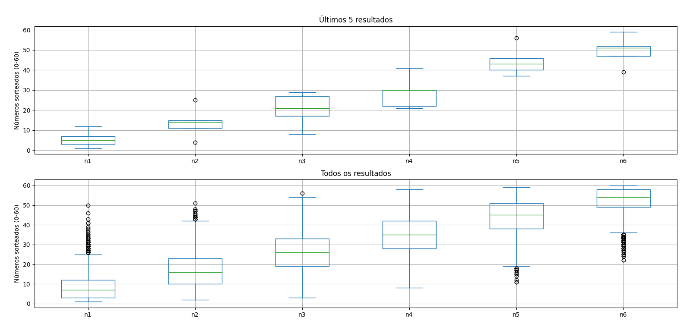
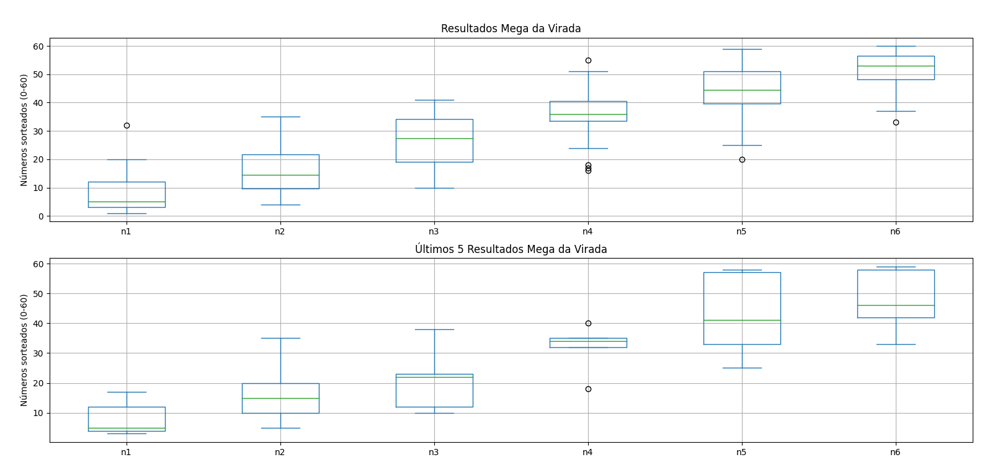

# Welcome to my lotto analysis

## What it does?

Gets all lottery results from [here](https://redeloteria.com.br/) and plots graphs

## How to run

### Install requirements:

```
pip3 install -r requirements.txt
```

```
# on linux / deb.
sudo apt install python3-tk
```

then

```
python3 ds.py
# or
py ds.py
```

## Screenshots

Histórico de resultados


Todos os resultados da mega-sena

